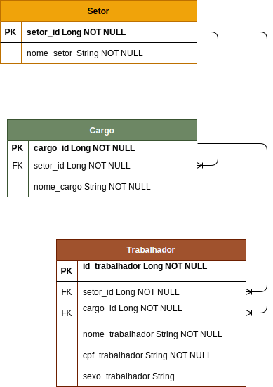

<html>
<header>
<h1>Api-administracao<h1>
</header>
<body>
🧪 Tecnologias

Esse projeto foi desenvolvido com as seguintes tecnologias:

<ol>
<li>
<strong>Backend</strong>
</li>
<ul>
<li><a href="https://docs.oracle.com/en/java/javase/11/core/java-core-libraries1.html">Java 11</a></li>
<li><a href="https://spring.io/projects/spring-boot">Spring Boot 2.5.5</a></li>
<li><a href="https://swagger.io/">Swagger</a></li>
<li><a href="https://www.postgresql.org/">PostgreSQL</a></li>
</ul>
</ol>

<strong>Gerenciameto de dependências</strong>
<ul>
<li>
<a href="https://gradle.org/">Gradle</a>
</li>
</ul>

Api-administracao permite criar e editar um Setor, adicionar um cargo ao setor, ao trabalhador e permite criar, editar um trabalhador.

<strong>Regra de negócios</strong>
<ul>
<li>

Não deve ser possível cadastrar um setor com o mesmo nome de outro
 existente;
</li>
<li>

Cargos ficam vinculados a um setor e não podem ser cadastrados em outros setores;

</li>
<li>

Um trabalhador está vinculado a um setor e a um cargo;

</li>
<li>

Não é possível ter dois trabalhadores com mesmo CPF;

</li>
</ul>

<strong>
Diagrama de classe:</strong>

</body>

<footer>
<strong>Contato :</strong>
<a href="https://www.linkedin.com/in/philogene/">Linkedin</a>
</footer>
</html>